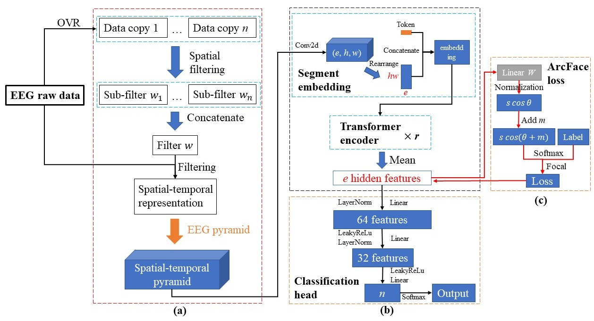

# Excellent fine-tuning: from specific-subject classification to cross-task classification for motor imagery

### Our method includes a data-augmented EEG pyramid and a fine-tuned Metric-based Spatial Filtering Transformer (MSFT) model. Upsampling the raw data, randomly cropping segments, and stacking them in the channel dimension to obtain local information from different time windows. Moreover, this method of random interception can also greatly increase the amount of training data. The MSFT is divided into three parts: the transformation of the raw data to the intermediate spatial-temporal pyramid, the feature extraction layer, and the classification layer. The classifier needs to be trained after the feature extraction layer is trained. Cross-subject and cross-task training requires fixing the parameters of the feature extractor, and then fine-tuning the classifier.

### The EEG raw data is preprocessed by CSP (refer to [TSF-STAN](https://github.com/Jia-Xueyu/TSF-STAN)), and then the final output is obtained through EEG pyramid and MSFT. The whole process of the method is shown in the figure below.

